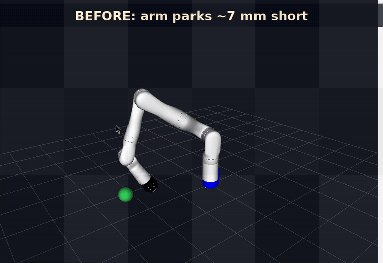
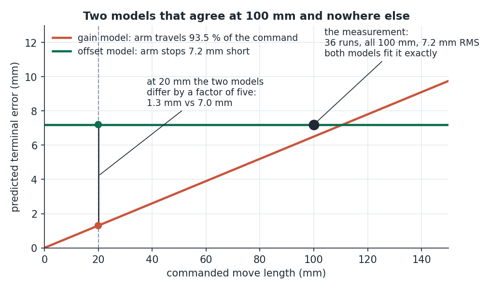
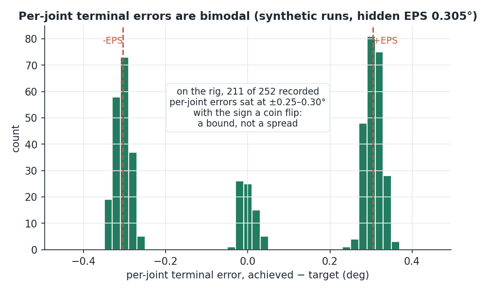
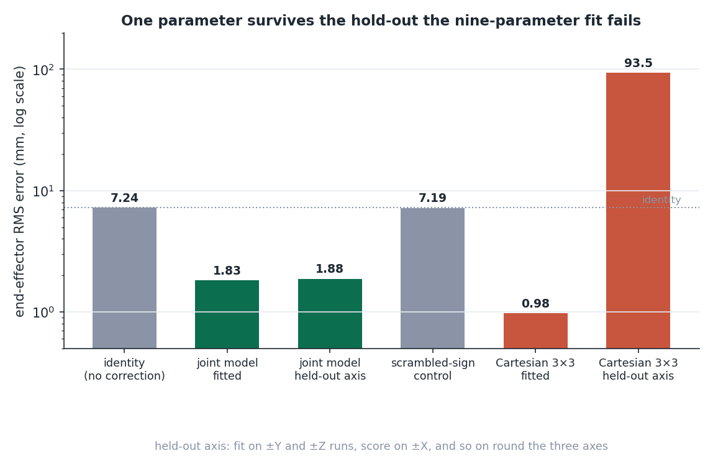
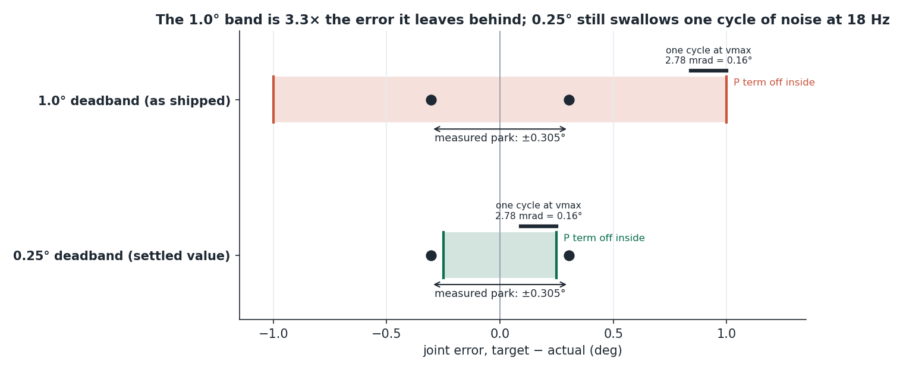
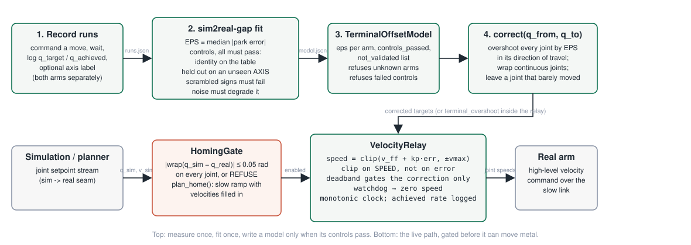
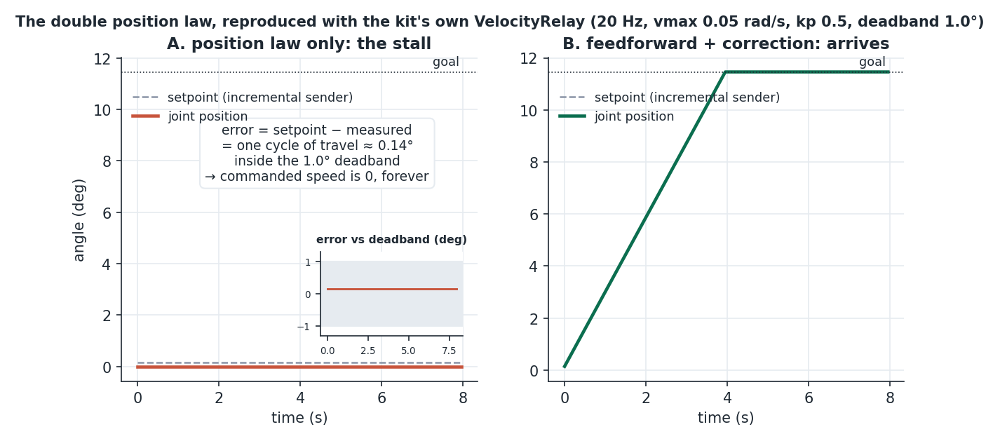

# ShortStop



*RViz simulation (Kinova Gen3). Before vs after.*

**Your arm stops short of where the simulation sent it. This kit measures by how much, tells you what shape the error is, fixes it in one line, and refuses to hand you a model that has not passed its own controls.**

Pure Python, `numpy` only, no ROS dependency. Fits from a JSON of recorded moves. Ships the fitted correction, a velocity relay for slow links, a deadband audit and a homing gate.

```
pip install git+https://github.com/megazron/shortstop-sim2real
sim2real-gap synth -o runs.json          # try it with synthetic runs
sim2real-gap fit runs.json -o model.json
```

---

## The problem

The measurement: **36 runs, both arms, six axis directions, 100 mm commanded each**, recording where the end effector was asked to go and where it ended up. It had been sitting in a JSON file for weeks and no code read it.

## What shape the error is, which is the whole point

Every run was a 100 mm step, so two models fit the Cartesian data identically:

| model | says | error on a 100 mm move | error on a 20 mm move |
|---|---|---|---|
| gain | the arm travels 93.5 % of what it is told | 7.2 mm | 1.3 mm |
| offset | the arm stops 7.2 mm short | 7.2 mm | **7 mm, a third of the move** |

A gain fitted at 100 mm and applied to short moves makes them worse, confidently.



*Two models that fit the 100 mm measurement identically and disagree by a factor of five at 20 mm.*

The **joint** data settles it. Pushing each run's per-joint terminal error through the arm's own Jacobian reproduces the observed Cartesian error to **90 % (r = 0.923)**. A Jacobian does not know how far the arm travelled, so neither does the error. And the joint errors are bimodal: **211 of 252 sit at ±0.25–0.30°, with the sign a coin flip**. That is a joint parking just inside a band on the side it arrived from, not a random stop.



*Per-joint terminal errors from the kit's own synthetic runs (hidden EPS 0.305°): two clusters at ±EPS and a small pile at zero from the joints that barely moved, the same shape the rig recorded.*

So the model is **one number**:

> every joint parks **EPS** radians short, on the side it came from
> EPS = 0.3052° (left arm), 0.3059° (right arm)

and the compensation is **overshoot each joint by EPS in its direction of travel**. No Cartesian matrix, no direction basis, no step length.

Measured: **7.24 → 1.83 mm** and **7.21 → 1.68 mm**, and the part that matters, **1.88 / 1.72 mm held out on an axis the fit never saw**, where a Cartesian 3×3 fitted to the same data scores **93.5 mm**. Both arms measured the same EPS to **0.0007°**, which is why one number is credible.



*End-effector RMS on the rig's 36 runs. The one-parameter joint model holds up on an axis it never saw; the nine-parameter Cartesian fit scores 93.5 mm there, and scrambling the signs of the joint correction sends it back to identity.*

### The cause was upstream

A terminal offset of 0.3° per joint is a controller that stops before it arrives. The relay driving the arm switched its proportional term off inside a **1.0° deadband, 3.3× the error it left behind**. The compensation above works; narrowing the deadband is the fix. The kit audits both.



*The shipped 1.0° deadband against the measured ±0.305° park, and the 0.25° value the rig settled on, with one control cycle of travel at 18 Hz drawn for scale.*

### The speed sweep that was not one

The 36 runs were labelled with three speeds and gave the same error to 0.1 mm. Not because the error is speed independent: `vmax` was read once at start-up, and **7 of 36 runs moved faster than the limit they were commanded with**. A limit that is exceeded was not applied. The three speeds were three replicates of one condition, and how the error varies with speed was never measured. The kit's model file carries a `not_validated` list for exactly this.

### Why a velocity relay at all

Over WSL2 the arm's cyclic (1 kHz) path is unusable: a single write cost **10 365 µs** against a 10 ms cycle budget, the controller manager overran permanently, and the arm sat still while serving perfectly live feedback. It looks exactly like a frozen driver and is not one. High-level **velocity** commands over the TCP session pay the same round trip but hold a motion between sends: **18–20 Hz achieved**, **26 ms average send latency**, tracking **0.01–0.15°**, homing all seven joints to within **0.98°**. `VelocityRelay` is that loop, with the two traps it hit already designed out.

---

## What the kit does

| piece | what it does |
|---|---|
| `sim2real-gap fit` | fits EPS per arm from recorded runs, runs five controls, writes a model only if they pass |
| `TerminalOffsetModel.correct()` | the joint target to *command* so the arm *arrives*; continuous joints wrap correctly across ±π |
| `TerminalOffsetModel.predict()` | where the arm will actually stop, so a divergence display does not read 0.3° off forever |
| `sim2real-gap deadband` | is the controller's deadband the cause of the park error? verdict and a recommendation |
| `VelocityRelay` | feedforward + feedback speed law for a slow link, clip on speed, watchdog, monotonic clock, achieved-rate logging |
| `HomingGate` / `plan_home()` | refuse to relay sim onto real until they agree; a synchronised slow ramp to get there |



*Top row: measure once, fit once, write a model only when its controls pass. Bottom row: the live path, gated before it can move metal.*

## Install

```
pip install git+https://github.com/megazron/shortstop-sim2real
# or, for development
git clone https://github.com/megazron/shortstop-sim2real && cd shortstop-sim2real && pip install -e .[dev] && pytest -q
```

## Quickstart

```
$ sim2real-gap synth -o runs.json
wrote 36 synthetic runs to runs.json (hidden EPS {'left': 0.3052, 'right': 0.3059} deg)

$ sim2real-gap fit runs.json -o model.json
arm left    18 runs  EPS = 0.3058 deg  (by axis hold-out)
  |e| cluster within +/-0.05 deg of median: 86%   sign +: 46%   sign follows -travel: 90%
  joint RMS  identity 0.2835 deg  corrected 0.0166  HELD OUT 0.0168  scrambled 0.3469
  noise curve (held-out deg at 0/0.5/1/2 x EPS noise): 0.0168, 0.1527, 0.3359, 0.5828
  [PASS] beats identity         held out 0.0168 vs identity 0.2835 deg (needs < 0.7x)
  [PASS] held out never fit     by axis, 3 folds
  [PASS] scrambled signs fail   scrambled 0.3469 vs identity 0.2835 deg (must be >= 0.9x)
  [PASS] noise degrades         held-out deg: 0.0168 -> 0.1527 -> 0.3359 -> 0.5828
  [PASS] enough runs            18 runs (need >= 3)
...
arms agree within 0.01 deg: yes
controls PASSED -- model may be written
model written to model.json

$ sim2real-gap correct model.json --arm left --from 0,0,0,0,0,0,0 --to 0.5,-0.5,0.5,-0.5,0.5,-0.5,0.5
command: 0.505337, -0.505337, 0.505337, -0.505337, 0.505337, -0.505337, 0.505337
overshot 7 of 7 joints by 0.3058 deg in the direction of travel; 0 moved <= 0.3058 deg and were left alone

$ sim2real-gap deadband --deadband-deg 1.0 --park-deg 0.305 --rate-hz 18 --vmax 0.05
CAUSE -- the deadband (1.000 deg) is 3.3x the measured park error (0.305 deg) ...
```

## Recording your own runs

Command a move, wait until the arm is still, record where it was sent and where it stopped. One JSON list, one object per run:

```json
{"arm": "left",
 "q_start":    [..7 rad..],      "optional: gives the direction of travel per joint",
 "q_target":   [..7 rad..],
 "q_achieved": [..7 rad..],
 "direction":  "+X",             "optional axis label: enables the by-axis hold-out",
 "ee_target":  [x, y, z], "ee_achieved": [x, y, z]   "optional, metres"}
```

Advice from the rig: at least three repeats per direction, both arms separately (their mounts differed by 168° of roll and a shared model was tested, not assumed: fit on one, predict the other, 7.2 → 4.3 mm, about half as good as its own). Vary the speed on purpose and check the log that the limit was applied.

## Python API

```python
from sim2real_gap import fit_runs, TerminalOffsetModel, VelocityRelay, HomingGate, plan_home, deadband_audit
import json, math

runs = json.load(open("runs.json"))["runs"]
report = fit_runs(runs, continuous_idx=(0, 2, 4, 6))     # Gen3: joints 1/3/5/7 are continuous
print(report.summary())
model = report.to_model()                                 # raises if controls failed
model.save("model.json")

m = TerminalOffsetModel.load("model.json")
q_cmd, applied, why = m.correct("left", q_now, q_goal)    # send q_cmd; the arm parks on q_goal
q_stop = m.predict("left", q_now, q_cmd)                  # what to compare the real arm against

gate = HomingGate(tolerance_rad=0.05, continuous_idx=(0, 2, 4, 6))
ok, joint, err = gate.check(q_sim, q_real)                # False -> do not enable the relay
plan = plan_home(q_real, q_sim, vmax_rad_s=0.05, rate_hz=20)   # points with velocities filled

relay = VelocityRelay(kp=0.5, vmax_rad_s=0.05, deadband_rad=math.radians(0.25), watchdog_s=0.5,
                      continuous_idx=(0, 2, 4, 6))
relay.set_target(q_target, velocities=None)               # from your setpoint stream
speeds = relay.step(q_actual)                             # rad/s per joint; send to the arm
print(relay.achieved_rate_hz, relay.latency_summary_ms())  # log THESE, never the configured rate

print(deadband_audit(1.0, 0.305)["text"])
```

`examples/ros2_relay_node.py` wraps the relay and gate in a ROS 2 node; `rclpy` is imported lazily and only there.

## Controls the fit enforces, and why

A model is written only when all of these pass. Each exists because the shortcut it blocks was taken once.

1. **Identity is on the table.** The uncorrected error is reported beside the corrected one. A correction that does not beat doing nothing is not a correction.
2. **Held out, never fit.** By *axis* when directions are labelled (+X and −X held out together, the hardest hold-out available and the one a Cartesian fit fails), otherwise K-fold by run. A leave-one-*direction*-out on ±X/±Y/±Z leaks: the opposite direction is still in the training set, and a relabelling null scores identically.
3. **Scrambled signs must fail.** Flip the sign of each joint's correction at random and the score must be no better than 0.9× identity. If destroying the sign structure does not destroy the model, the model was not using it.
4. **Noise must degrade it monotonically.** Inject noise at three levels; the held-out score has to get worse each time. A metric that cannot be made worse cannot be trusted when it is good.
5. **Enough runs**, and both arms fitted separately with their agreement reported rather than assumed.

Two design rules carried over from the rig: a joint whose travel is smaller than EPS is left alone (overshooting it is a guess about which way something that barely moved was going), and continuous joints are differenced the short way round, because naive subtraction across the ±π seam reports 288° for a 69.5° move and puts the overshoot on the wrong side, the one thing this correction must never do.

## Two traps `VelocityRelay` designs out

- **Applying a position law twice.** Senders that publish an incremental setpoint (`cur + v·dt`) put the target ~1.7 mrad ahead of the measured position. A pure position law with a 17 mrad deadband sees an error an order of magnitude inside the band and commands exactly zero, forever. The relay takes the setpoint's own rate as the command and uses position error only as a correction; the deadband suppresses the correction, never the feedforward.

  

  *Reproduced with the kit's own `VelocityRelay` on an ideal joint: with a pure position law the incremental setpoint stays one cycle ahead, inside the deadband, and nothing moves; with the sender's rate as feedforward the joint arrives.*
- **`time.time()` for intervals.** Under WSL the wall clock steps backwards on host resync; the first run logged a send latency of **−2321 ms**. Every interval uses an injected monotonic clock.

## Rules the rig paid for, worth carrying into your relay

- **Completion tolerance is not the deadband.** Homing "complete" is judged against `HomingGate` tolerance (0.05 rad on the rig), never against the controller deadband. Conflating them produced a phantom `HOMING STALLED` while the arm sat 0.99 deg out, exactly at the deadband edge.
- **Use hysteresis on the deadband.** Enter the band at one width, leave only past a wider one. A single threshold made a joint stop just inside the band and hunt there at 2.4-2.7 deg.
- **The enable gap is not the trip threshold.** Enable a relay only when sim and real are well inside the lag limit that trips the e-stop. Enabling exactly at the trip limit means the first monitor tick after the grace period trips.
- **Rate collapses with device count on a shared link.** One arm ran at 21 Hz with 12-33 ms latency; two arms on the same WSL link fell to 8-12 Hz with 519 ms spikes, past a 0.5 s watchdog that then zeroed speed while the joints were still being commanded. Budget the rate per device, and log the achieved rate.
- **After fixing a gate, verify the behaviour changed.** Two gates in series hide each other: teleop still homed after the relay's home requirement was relaxed, because the launch script had no `home:=` argument at all.
- **SIGINT, never SIGKILL, on single-session hardware.** A killed bridge leaks the arm's only session and the next run cannot connect.

## License

MIT © 2026 Gaus Mohiuddin Sayyad
